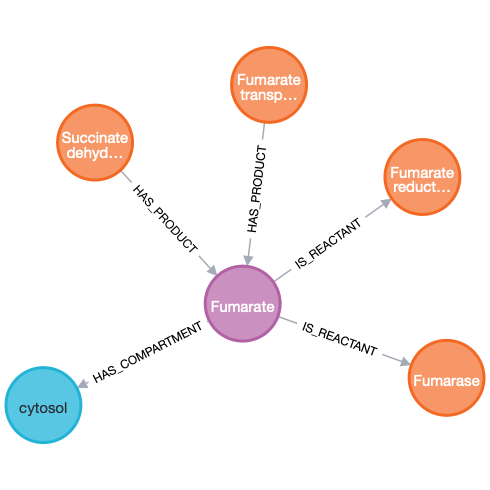

# Neo4jSbml

[](version) [](https://github.com/psf/black)  
[](https://neo4jsbml.readthedocs.io/en/latest/?badge=latest) [](https://github.com/marketplace/actions/super-linter)  
[](https://zenodo.org/badge/latestdoi/585859244)  

## Install

```sh
conda install -c conda-forge neo4jsbml
```

## Usage

### Step 1

Create a schema with [arrows](https://arrows.app) like:  
  
Rules:
* Nodes are labelled based on SBML object name as defined in the [SBML specification](https://sbml.org)
* Properties are labelled based on SBML object properties as defined the [SBML specification](https://sbml.org)

### Step 2

Export your schema at the JSON format.  


### Step 3

Import your data with `neo4jsbml` into Neo4j.  
* Use either a configuration file `ini` or individual parameters
* Password needs to be store in a file for safety security
* If you have multiple model in the database, pass a `tag` to identify the model loaded into the database if you want to avoid collision

```sh
neo4jsbml \
    # Database parameters
    --input-protocol-str ["neo4j", "neo4j+s", "neo4j+ssc", "bolt", "bolt+s", "bolt+ssc"] \
    --input-url-str "localhost" \
    --input-user-str "neo4j" \
    --input-port-int <port> \
    --input-password-file <file> \
    --input-database-str <str> \
    # Config file
    --input-config-file <file> \
    # AuraDB file
    --input-auradb-file <file> \

    # Input
    --input-file-sbml <file> \
    --input-modelisation-json <file> \

    # Parameter
    --input-tag-str ""
```

## Config file

### Neo4jsbml

A config file is expected `.ini`
```ini
[connection]
protocol = neo4j
url = localhost
port = 7687

[database]
user = neo4j
password = abc
name = neo4j
```

### AuraDB

A file provided by AuraDB
```bash
# one comment
NEO4J_URI=neo4j+s://test.neo4j.io
NEO4J_USERNAME=neo4j
NEO4J_PASSWORD=thepassword
# second comment
AURA_INSTANCEID=422DEf4
AURA_INSTANCENAME=Instance01
```
