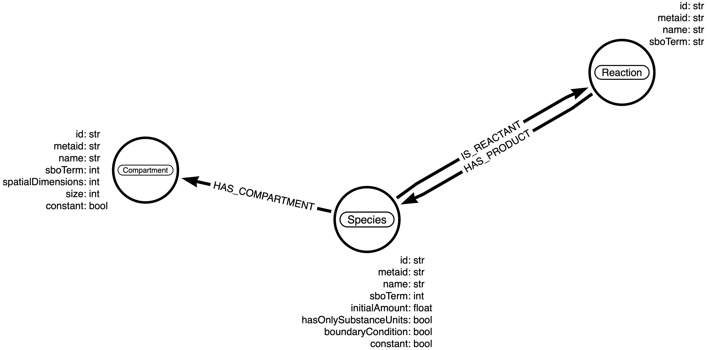

# Neo4jSbml

[](version)  
[](https://github.com/psf/black)  
[](https://github.com/marketplace/actions/super-linter) [](coveralls)  

## Install

```sh
git clone git@github.com:brsynth/neo4jsbml.git
cd neo4jsbml
conda env create -n neo4jsbml -f recipes/workflow.yml
conda activate neo4jsbml
pip install --no-deps .
```

## Usage

### Step 1

Create a schema with [arrows](https://arrows.app) like:  

Rules:
* Nodes are labelled based on SBML object name as defined in the [SBML specification](https://sbml.org)
* Properties are labelled based on SBML object properties as defined the [SBML specification](https://sbml.org)

### Step 2

Export your schema at the JSON format.

### Step 3

Import your data with `neo4jsbml` into Neo4j.  
* Use either a configuration file `.ini` or individual paramters
* Password needs to be store in a file for safety security
* Pass a `tag` to identify the model loaded into the database

```sh
python -m neo4jsbml \
    # Database parameters
    --input-protocol-str ["neo4j", "bolt"] \
    --input-url-str "localhost" \
    --input-port-int 7687 \
    --input-user-str "neo4j" \
    --input-password-file <file> \
    --input-database-str <str> \
    --input-batch-int <int> \
    # Config file
    --input-config-file <file> \

    # Input
    --input-file-sbml <file> \
    --input-tag-str "" \
    --input-modelisation-json <file>
```

## Test

```sh
python -m pytest
```
