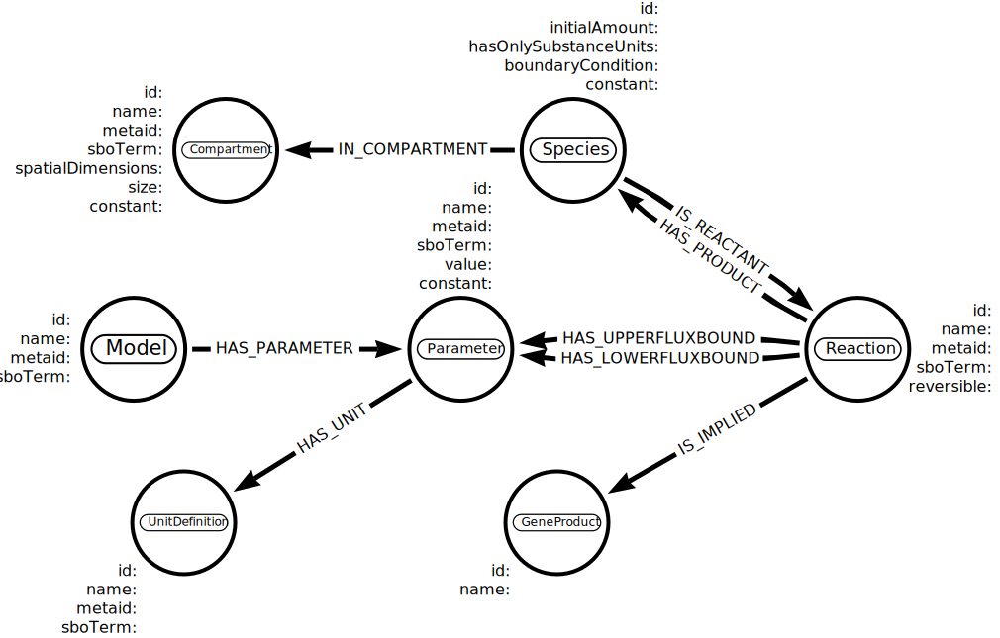
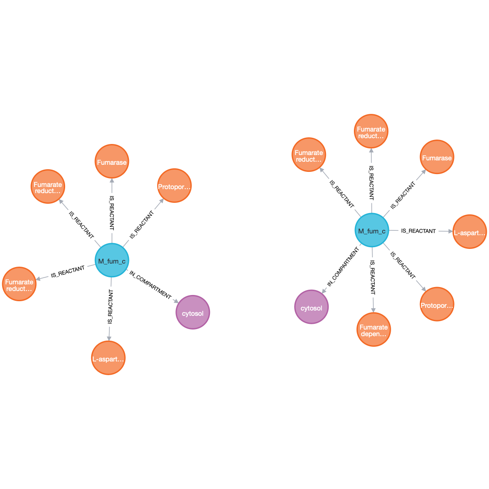
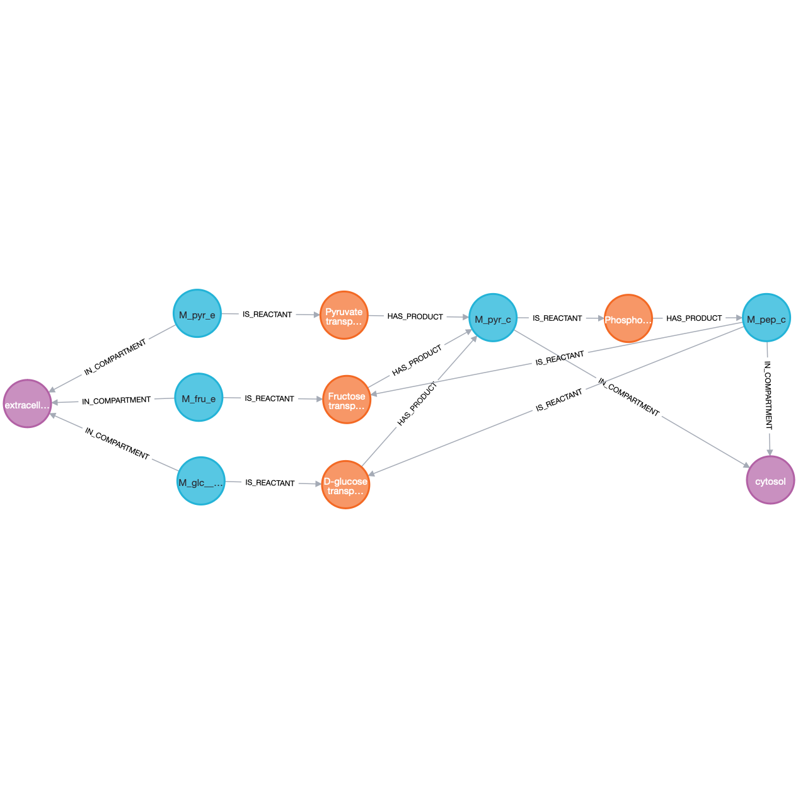
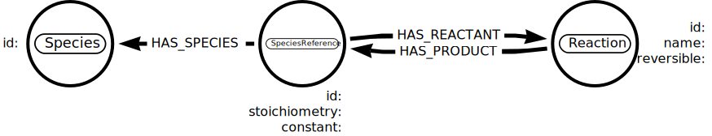
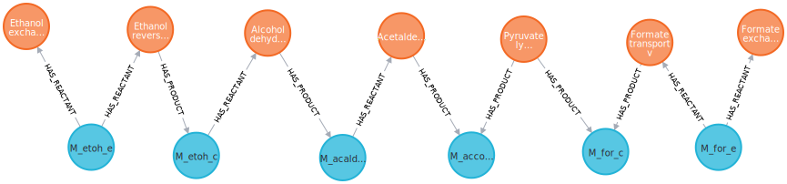
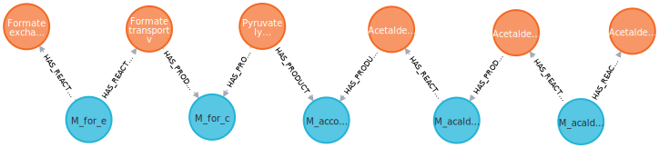

Real-life applications
======================

View shared metabolite
----------------------

View shared metabolite, fumarate, between two models: *iAF1260* and *iML1515* available from `BiGG <http://bigg.ucsd.edu>`_

Arrows modelisation
^^^^^^^^^^^^^^^^^^^
:download:`(JSON schema) <_static/arrows/PathwayModelisation-2.0.2.json>`

Neo4jSbml
^^^^^^^^^
.. code-block:: console

    $ neo4jsbml sbml-to-neo4j \
        --input-config-ini tests/dataset/database/localhost.ini \
        --input-arrows-json tests/dataset/modelisation/PathwayModelisation-2.0.2.json \
        --input-model-sbml tests/dataset/model/iML1515.xml.gz \
        --parameter-tag-property-str iML1515
    $ neo4jsbml sbml-to-neo4j \
        --input-config-ini tests/datasets/database/localhost.ini \
        --input-arrows-json tests/dataset/modelisation/PathwayModelisation-2.0.2.json \
        --input-model-sbml tests/dataset/model/iAF1260.xml.gz \
        --paramter-tag-property-str iAF1260

Query Cypher
^^^^^^^^^^^^
.. code-block:: cypher

    MATCH p=((c:Compartment)<--(n:Species {id: "M_fum_c"})-->(r:Reaction)) RETURN p

Neo4j
^^^^^

View precursors
---------------

Visualization of the Phosphoenolpyruvate and its precursors at exactly two reactions in the *e_coli_core* available from `BiGG <http://bigg.ucsd.edu>`_

Arrows modelisation
^^^^^^^^^^^^^^^^^^^
:download:`(JSON schema) <_static/arrows/PathwayModelisation-2.0.2.json>`

Neo4jSbml
^^^^^^^^^
.. code-block:: console

    $ neo4jsbml sbml-to-neo4j \
        --input-config-ini tests/dataset/database/localhost.ini \
        --input-arrows-json tests/dataset/modelisation/PathwayModelisation-2.0.2.json \
        --input-model-sbml tests/dataset/model/e_coli_core.xml.gz

Query Cypher
^^^^^^^^^^^^

Flag the metabolite nodes implied in more than 10 reactions.

.. code-block:: cypher

    MATCH (s:Species)
    WITH s, size ([p=(s)-[:IS_SUBSTRATE]->() | p]) as sz order by sz desc
    where sz >10
    SET s:Hub

Select the nodes to highlight them

.. code-block:: cypher

    MATCH path=(:Compartment)<-[:IN_COMPARTMENT]-(s1:Species {id: "M_pep_c"})<-[:HAS_PRODUCT|IS_SUBSTRATE*2]-(s2:Species)<-[:HAS_PRODUCT|IS_SUBSTRATE*2]-(s3:Species)-[:IN_COMPARTMENT]->(:Compartment)
    WHERE NOT "Hub" IN apoc.coll.flatten([n in nodes(path) | labels(n)])
        AND (s3)-[:IN_COMPARTMENT]->(:Compartment {id: "e"})
        AND NOT (s2)-[:IN_COMPARTMENT]->(:Compartment {id: "e"})
    RETURN path

Neo4j
^^^^^

Enumerate pathway
-----------------

Visualization of the pathways where the formate and the Acetaldehyde where involved in the *e_coli_core* available from `BiGG <http://bigg.ucsd.edu>`_

Arrows modelisation
^^^^^^^^^^^^^^^^^^^
:download:`(JSON schema) <_static/arrows/EnumeratePathway.json>`

Neo4jSbml
^^^^^^^^^
.. code-block:: console

    $ neo4jsbml sbml-to-neo4j \
        --input-config-ini tests/dataset/database/localhost.ini \
        --input-arrows-json tests/dataset/modelisation/EnumeratePathway.json \
        --input-model-sbml tests/dataset/model/e_coli_core.xml.gz

Graph Refactoring
^^^^^^^^^^^^^^^^^

Add the ID of the Species nodes into the SpeciesReference.

.. code-block:: cypher

    MATCH (n:SpeciesReference)-[:HAS_SPECIES]->(s:Species) SET n.id = s.id

Remove the Species nodes.

.. code-block:: cypher

    MATCH (n:Species) DETACH DELETE n

Rename the nodes SpeciesReference to Species

.. code-block:: cypher

    MATCH (n:SpeciesReference) REMOVE n:SpeciesReference SET n:Species

Remove dense nodes

.. code-block:: cypher

    MATCH (s:Species)
    WITH s, size ([p=(s)-[:HAS_REACTANT]->() | p]) as sz order by sz desc
    WHERE sz > 4
    SET s.hub = true

    MATCH (s:Species)
    WITH s, size ([p=(s)<-[:HAS_PRODUCT]-() | p]) as sz order by sz desc
    WHERE sz > 4
    SET s.hub = true

    MATCH (s:Species) WHERE s.hub DETACH DELETE s

Download the plugin Neo4jEfmtool :download:`(JAR file) <https://raw.githubusercontent.com/brsynth/neo4jsbml/main/neo4jefmtool/target/neo4jefmtool-0.1.0-SNAPSHOT.jar>` and move it to the plugin directory of your instance Neo4j.
Restart your database then call the procedure:

.. code-block:: cypher

    CALL brsynth.enumeratePathway(["M_for_c", "M_acald_c"], "ep")

Neo4j
^^^^^

View the first pathway

.. code-block:: cypher

    MATCH (n) WHERE 1 IN n.ep RETURN n

View the second pathway

.. code-block:: cypher

    MATCH (n) WHERE 2 IN n.ep RETURN n

