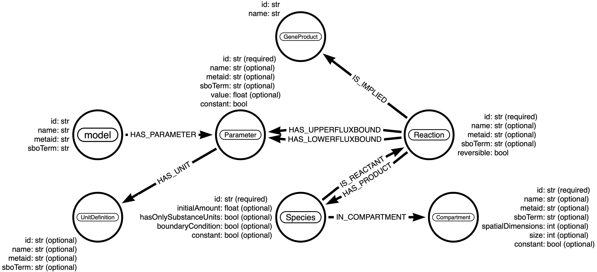
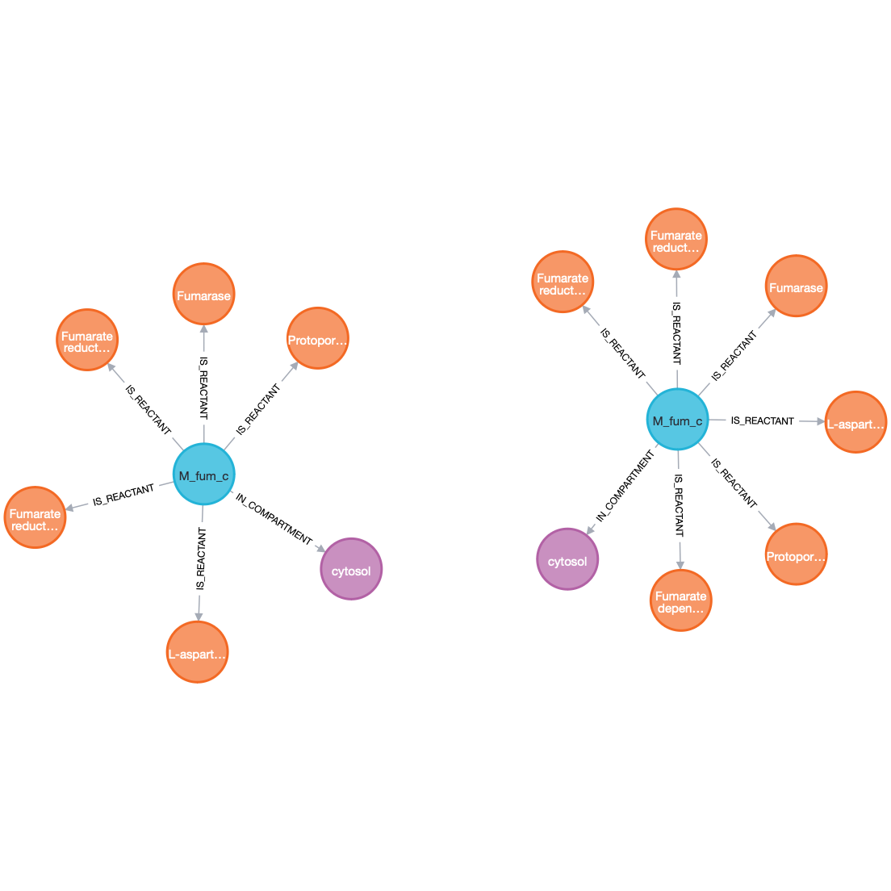
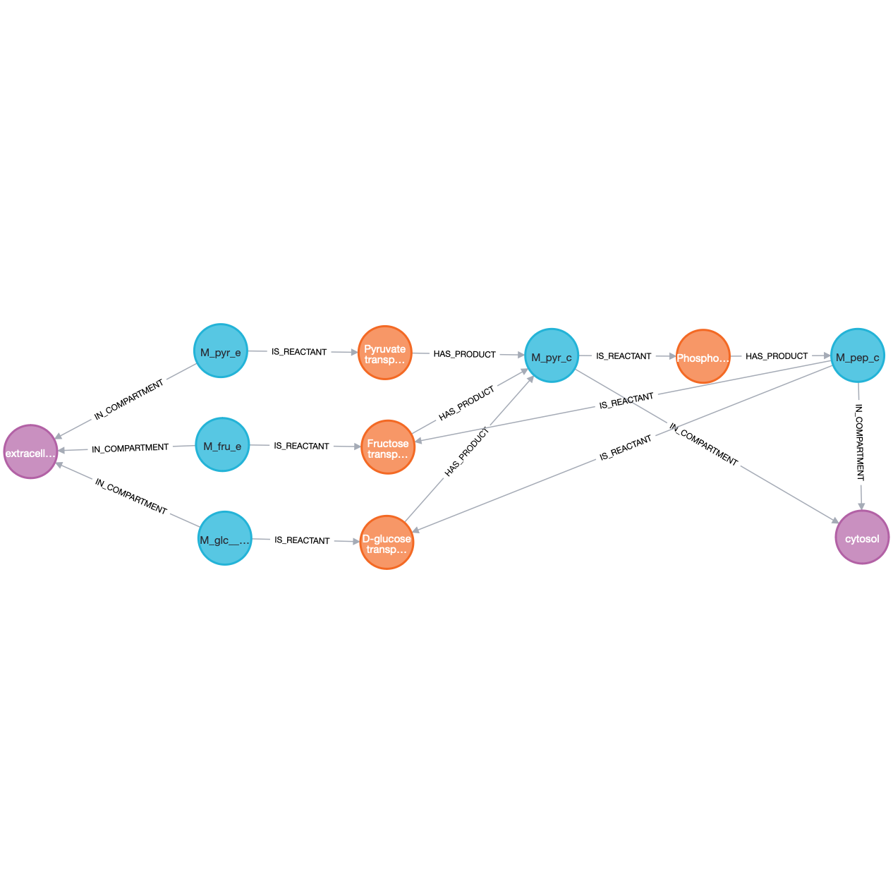

Example
=======

View shared metabolite
----------------------

View shared metabolite, fumarate, between two models: *iAF1260* and *iML1515* available from `BiGG <http://bigg.ucsd.edu>`_

.. code-block:: console

    $ neo4jsbml \
        --input-config-file tests/dataset/database/localhost.ini \
        --input-modelisation-json tests/dataset/modelisation/PathwayModelisation-2.0.2.json \
        --input-file-sbml tests/dataset/model/iML1515.xml.gz \
        --input-tag-str iML1515
    $ neo4jsbml \
        --input-config-file tests/datasets/database/localhost.ini \
        --input-modelisation-json tests/dataset/modelisation/PathwayModelisation-2.0.2.json \
        --input-file-sbml tests/dataset/model/iAF1260.xml.gz \
        --input-tag-str iAF1260

**Arrows modelisation**

**Query Cypher**

.. code-block:: cypher

    MATCH p=((c:Compartment)<--(n:Species {id: "M_fum_c"})-->(r:Reaction)) RETURN p

**Neo4j View**

View precursors
---------------

Visualization of the Phosphoenolpyruvate and its precursors at exactly two reactions in the *e_coli_core* available from `BiGG <http://bigg.ucsd.edu>`_

.. code-block:: console

    $ neo4jsbml \
        --input-config-file tests/dataset/database/localhost.ini \
        --input-modelisation-json tests/dataset/modelisation/PathwayModelisation-2.0.2.json \
        --input-file-sbml tests/dataset/model/e_coli_core.xml.gz

**Arrows modelisation**

**Query Cypher**

Flag the metabolite nodes implied in more than 10 reactions.

.. code-block:: cypher

    MATCH (s:Species)
    WITH s, size ([p=(s)-[:IS_SUBSTRATE]->() | p]) as sz order by sz desc
    where sz >10
    SET s:Hub

Select the nodes to highlight them

.. code-block:: cypher

    MATCH path=(:Compartment)<-[:IN_COMPARTMENT]-(s1:Species {id: "M_pep_c"})<-[:HAS_PRODUCT|IS_SUBSTRATE*2]-(s2:Species)<-[:HAS_PRODUCT|IS_SUBSTRATE*2]-(s3:Species)-[:IN_COMPARTMENT]->(:Compartment)
    WHERE NOT "Hub" IN apoc.coll.flatten([n in nodes(path) | labels(n)])
        AND (s3)-[:IN_COMPARTMENT]->(:Compartment {id: "e"})
        AND NOT (s2)-[:IN_COMPARTMENT]->(:Compartment {id: "e"})
    RETURN path

**Neo4j View**

