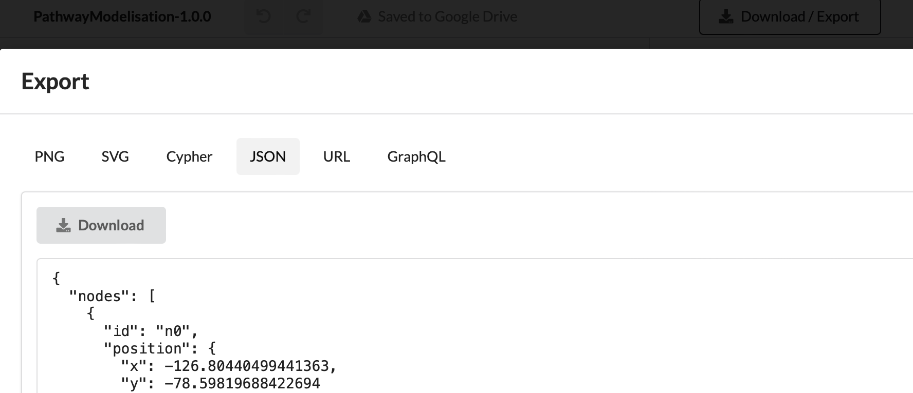

Usage
=====

Installation
------------

With conda:

.. code-block:: console

   $ conda install -c conda-forge neo4jsbml

Principles
----------

Import data from SBML into the Neo4j database is conducted in several steps:

1. Define your schema with `Arrows <https://arrows.app>`_ and download the schema at the ``JSON`` format
2. Import your data into Neo4j

Define your schema with Arrows
------------------------------

**Create the schema**
First of all, the users create a schema defining which entities will be selected from the SBML model with `arrows <https://arrows.app>`_.

Rules:

* Nodes are labelled based on SBML object name as defined in the `SBML specification <https://sbml.org>`_
* Properties are labelled based on SBML object properties as defined the `SBML specification <https://sbml.org>`_

**Download the schema**

Configure access to Neo4j
-------------------------

The connection to the Neo4j database needs to have several parameters defined:

* protocol: ``neo4j``, ``neo4j+s``, ``neo4j+ssc``, ``bolt``, ``bolt+s``, ``bolt+ssc`` (default: ``neo4j``)
* url (default: ``localhost``)
* user name (default: ``neo4j``)
* port (default: ``None``)
* password (default: ``None``)
* database name (default: ``neo4j``)

The user has two options: passing arguments individually by the command line or by an ``ini`` file with this structure:

**Command line**

``--input-protocol-str``
    Protocol to communicate with the database

``--input-url-str``
    Url of Neo4j

``--input-port-int``
    Port number tot communicate with the database

``--input-user-str``
    Username to log with the database

``--input-password-txt``
    Password to log with the database

``--input-database-str``
    Database name

**Configuration file**
Several options, either

``--input-config-ini``
    An ``ìni`` file containing all these informations above

.. code-block:: toml

    [connection]
    protocol = neo4j
    url = localhost
    port = 7687

    [database]
    user = neo4j
    password = mypassword
    name = neo4j

.. note::
    For safety, passing a password through the command line must be given by a file.
    No extra character must be in the file, otherwise it would be consider as the password.

or either

``--input-auradb-txt``
    A ``txt`` file provided by AuraDB

.. code-block:: bash

    # one comment
    NEO4J_URI=neo4j+s://test.neo4j.io
    NEO4J_USERNAME=neo4j
    NEO4J_PASSWORD=thepassword
    # second comment
    AURA_INSTANCEID=422DEf4
    AURA_INSTANCENAME=Instance01

Import your data into Neo4j
---------------------------

Command line
~~~~~~~~~~~~
To import your data with ``neo4jsbml`` into Neo4j, you will need:
1. the database parameters
2. the ``SBML`` file, e.g. the model
3. the ``JSON`` file downloaded from `arrows <https://arrows.app>`_

.. code-block:: console

    $ neo4jsbml sbml-to-neo4j
        <database parameters>

        --input-model-sbml <file> \
        --input-arrows-json <file>

.. note::
    If you have multiple model in the database, pass a ``tag`` to identify the model loaded into the database if you want to avoid collision with the argument ``--parameter-tag-property-str``

Plugins compatibility
~~~~~~~~~~~~~~~~~~~~~
| Package                                                 | Compatibility |
| ------------------------------------------------------- | ------------- |
| Arrays                                                  | No            |
| Hierarchical Model Composition                          | No            |
| Distributions                                           | No            |
| Dynamic Structures                                      | No            |
| Flux Balance Constraints                                | Yes           |
| Groups                                                  | Yes           |
| Layout                                                  | Yes           |
| Extended MathML                                         | No            |
| Multistate, Multicomponent and Multicompartment Species | No            |
| Qualitative models                                      | Yes           |
| Rendering                                               | No            |
| Spatial Processes                                       | No            |

Export your data into Neo4j
---------------------------

Command line
~~~~~~~~~~~~
To export your data with ``neo4jsbml`` into Neo4j, you will need:
1. the database parameters
1. the ``JSON`` file downloaded from `arrows <https://arrows.app>`_

.. code-block:: console

    $ neo4jsbml sbml-from-neo4j
        <database parameters>

        --input-arrows-json <file> \
        --output-model-sbml <file>

.. note::
    neo4jsbml tries to map your arrows schema to the structure of the SBML document. It's better to keep the SBML structure in Neo4j and in the Arrows schema, notably to keep a Model entity.

Plugins compatibility
~~~~~~~~~~~~~~~~~~~~~
| Package                                                 | Compatibility |
| ------------------------------------------------------- | ------------- |
| Arrays                                                  | No            |
| Hierarchical Model Composition                          | No            |
| Distributions                                           | No            |
| Dynamic Structures                                      | No            |
| Flux Balance Constraints                                | No            |
| Groups                                                  | No            |
| Layout                                                  | No            |
| Extended MathML                                         | No            |
| Multistate, Multicomponent and Multicompartment Species | No            |
| Qualitative models                                      | No            |
| Rendering                                               | No            |
| Spatial Processes                                       | No            |

API
~~~
.. code-block:: python

    from neo4jsbml import arrows, connect, sbml

    # Either you have a configuration file or overwrite individually
    path_config = None
    con = connect.Connect.from_config(path=path_config)
    # Or
    path_password = None
    con = connect.Connect(
        protocol="neo4j",
        url="localhost",
        port="7687",
        user="neo4j"
        database="neo4j",
        password_path=path_password,
    )

    # Load model - Define a tag here if needed
    tag = None
    path_model = ""
    sbm = sbml.Sbml.from_sbml(path=path_model, tag=tag)

    # Load modelisation
    path_modelisation = ""
    arr = arrows.Arrows.from_json(path=path_modelisation)

    # Mapping
    nod = sbm.format_nodes(nodes=arr.nodes)
    rel = sbm.format_relationships(relationships=arr.relationships)

    # Import into neo4j
    con.create_nodes(nodes=nod)
    con.create_relationships(relationships=rel)
